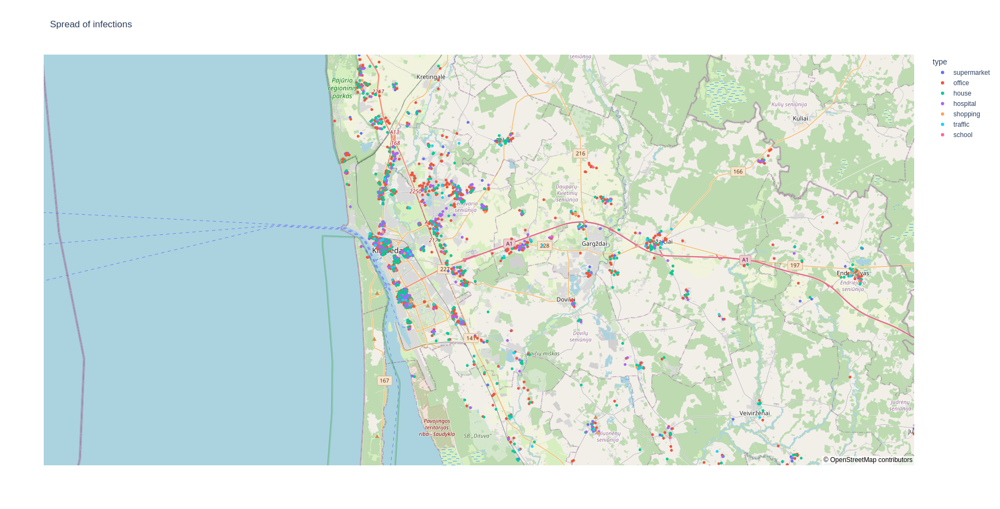

FabCovid19: Automated FACS simulation
=====================================

To automate the execution and analysis of FACS, we use a FabSim3-based FabCovid19 plugin (https://github.com/djgroen/FabCovid19). It provides an environment for researchers and organisations to construct and modify simulations, instantiate and execute multiple runs for different policy decisions, as well as to validate and visualise the obtained results against the existing data.

Setup
*****

Installing the FabSim3 automation toolkit
-----------------------------------------
To install FabSim3, you need to clone the FabSim3 repository:
  
  .. code:: console

          git clone https://github.com/djgroen/FabSim3.git

To configure FabSim3 and install required dependencies, go to https://fabsim3.readthedocs.io/en/latest/installation.html that provides detailed instructions.

Installing the FabCovid19 plugin
--------------------------------

Once you have installed FabSim3, you can install FabCovid19 by typing:

  .. code:: console
  
          fabsim localhost install_plugin:FabCovid19

The FabCovid19 plugin will appear in ``<FabSim3_dir>/plugins/FabCovid19``.

Configuration
-------------

There are a few small configuration steps to follow:

1. Go to ``<FabSim3_dir>/plugins/FabCovid19``.

2. copy ``machines_FabCovid19_user_example.yml`` as ``machines_FabCovid19_user.yml``.

3. open ``machines_FabCovid19_user.yml``.

4. Under the section ``localhost``, and set ``facs_location`` value with the actual path of FACS in your local PC.

	.. code-block:: yaml

		localhost:
			# location of FACS in your local PC
			facs_location: "<PATH to you local FACS installation>"

Execution
*********

Run a single job
----------------

To run a single job, simply type:

.. code-block:: sh

	fabsim <localhost/remote machine> covid19:<location_scenario>,<TS=transition scenario>,<TM=transition mode>,[outdir=output directory]

where
	* ``configs`` : the name of borough, the full list can be found in https://github.com/djgroen/FabCovid19/tree/master/config_files 
	* ``measures``: name of the measures.yml file used, minus the .yml extension. This file should reside in the covid_data subdirectory

Example:

.. code-block:: sh

	fabsim localhost covid19:configs=harrow,measures=measures

Run an ensemble job
-------------------
To an an ensemble simulation of FACS, 

.. code-block:: sh

	fab <localhost/remote machine> covid19_ensemble:configs='<area_name>;<area2_name>'[,measures=<list of measures files>] 

.. note::
	By default, the measures.yml file will be used in simulations.

Examples:

.. code-block:: sh

        fabsim localhost covid19_ensemble:configs='test',cores=1,replicas=1,measures=measures,starting_infections=10,job_wall_time=0:15:00

	fabsim localhost covid19_ensemble:configs='harrow'

	fabsim localhost covid19_ensemble:configs='brent;harrow;hillingdon'

To run an ensemble of parallel runs, using 4 cores per run, you can use a comment like the following examples:

.. code-block:: sh

        fabsim localhost covid19_ensemble:configs='brent',cores=4,replicas=1,simulation_period=500,measures=measures,starting_infections=460,job_wall_time=1:00:00,solver=pfacs

        fabsim localhost covid19_ensemble:configs='test',cores=4,replicas=1,starting_infections=460,measures=measures,solver=pfacs

If you ran an ensemble jobs, you may need to do averaging across runs on the output csv files before plotting, in that case you can type:

.. code-block:: sh
	
	fabsim <localhost/remote machine> cal_avg_csv:<location_scenario>,<measures=measure_yml_file>

Examples:

* submit an ensemble job, containing 25 identically configured simulations:

	.. code-block:: sh

		fabsim localhost covid19_ensemble:configs='brent',measures='measures;measures_nolockdown',replicas=25

* submit an ensemble job using QCG-PilotJob:

	.. code-block:: sh

		fabsim localhost covid19_ensemble:configs='brent',measures=measures,replicas=25,PilotJob=true

* fetch results:

	.. code-block:: sh

		fabsim localhost fetch_results

* Calculate averages across runs (not recently tested):

	.. code-block:: sh

		fabsim localhost cal_avg_csv:brent,measures='lockdown_uk'
		fabsim localhost cal_avg_csv:brent,measures='lockdown_uk'

Run a validation job
--------------------
To run a validation simulation, simply type:

.. code-block:: sh

	fabsim localhost facs_validation

Visualisation
*************

.. note::
	Before you executing any visualisation commands, you should fetch the results using::
	
		fabsim <machine_name> fetch_results

	This will create various subdirectories in the ``<FabSim3_dir>/results`` directories. the name of these directories will be referred to as ``results_dir_name`` in this documentatioin.
	

Basic post-processing (No. of infectios people and ICU admissions)
------------------------------------------------------------------

To perform the post-processing on the output results from a single results directory, simple type:

.. code-block:: sh

	fabsim localhost facs_postprocess:<results_dir_name>

On running this command, you should get a web page that shows a plot like this:

.. image:: validateplot.png        

Thge top and bottom panels of the figure shows number of infectious people and the number of hospitalisations as time progrssses.

Comparing the infection-spread by location type
-----------------------------------------------

Similarly, you can perform a comparison on infectious spread by location type. To do so, type:

.. code-block:: sh

	fabsim localhost facs_locationplot:<results_dir_name>

This should give you a web page that shows a plot like this:

.. image:: locationplot.png        

This plot would show the number of infections which occurred in various types of locations on each day. 

Infections on a map during a period of time
-------------------------------------------

To see the locations where the infections occurred during a period of time, simply type:

.. code-block:: sh

	fabsim localhost facs_mapspread:<results_dir_name>,<starting_day>-<end_day>

This should give you a web page that shows a plot like this:

To visualise the data for a single day, type:

.. code-block:: sh

	fabsim localhost facs_mapspread:<day>

.. note:: 
	The ``day``, ``starting_day`` and ``end_day`` arguments represent the number of days since the start of the simulation and not the dates.