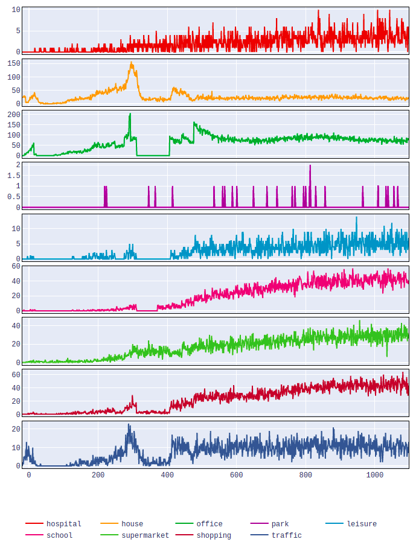

FabCovid19: Automated FACS simulation
=====================================

To automate the execution and analysis of FACS, we use a FabSim3-based FabCovid19 plugin (https://github.com/djgroen/FabCovid19). It provides an environment for researchers and organisations to construct and modify simulations, instantiate and execute multiple runs for different policy decisions, as well as to validate and visualise the obtained results against the existing data.

Installing the FabSim3 automation toolkit
-----------------------------------------
To install FabSim3, you need to clone the FabSim3 repository:
  
  .. code:: console

          git clone https://github.com/djgroen/FabSim3.git

To configure FabSim3 and install required dependencies, go to https://fabsim3.readthedocs.io/en/latest/installation.html that provides detailed instructions.

Installing the FabCovid19 plugin
--------------------------------

Once you have installed FabSim3, you can install FabCovid19 by typing:

  .. code:: console
  
          fabsim localhost install_plugin:FabCovid19

The FabCovid19 plugin will appear in ``<FabSim3_dir>/plugins/FabCovid19``.

Configuration
~~~~~~~~~~~~~

There are a few small configuration steps to follow:

1. Go to ``<FabSim3_dir>/plugins/FabFlee``.

2. copy ``machines_FabCovid19_user_example.yml`` as ``machines_FabCovid19_user.yml``.

3. open ``machines_FabCovid19_user.yml``.

4. Under the section ``localhost``, and set ``facs_location`` value with the actual path of FACS in your local PC.

	.. code-block:: yaml

		localhost:
			# location of FACS in your local PC
			facs_location: "<PATH to you local FACS installation>"
		
   
Automated FACS execution using FabCovid19
-----------------------------------------

Run a single job
~~~~~~~~~~~~~~~~

To run a single job, simply type:

.. code-block:: sh

	fabsim <localhost/remote machine> covid19:<location_scenario>,<TS=transition scenario>,<TM=transition mode>,[outdir=output directory]

where
	* ``location_scenario`` : the name of borough, the full list can be found in https://github.com/djgroen/FabCovid19/tree/master/config_files 
	* ``TS``: is the Transition Scenario. The acceptable inputs are : [`no-measures`, `extend-lockdown`, `open-all`, `open-schools`, `open-shopping`, `open-leisure`, `work50`, `work75`, `work100`, and `dynamic-lockdown`]
	* ``TM``: is the Transition Mode. The acceptable inputs are : [`1`, `2`, `3`, and `4`]

Example:

.. code-block:: sh

	fabsim localhost covid19:harrow,TS=periodic-lockdown,TM=1,ci_multiplier=0.3

Run an ensemble job
~~~~~~~~~~~~~~~~~~~
To an an ensemble simulation of FACS, 

.. code-block:: sh

	fab <localhost/remote machine> covid19_ensemble:location=<area_name>[,TS=transition scenario list][,TM=transition mode list] 

.. note::
	By default, all Acceptable Transition Scenario and Mode will be executed if these ``TS`` and ``TM`` parameters did not passed

Examples:

.. code-block:: sh

        fabsim localhost covid19_ensemble:location='test',TS='uk-forecast',TM='0',cores=1,replicas=1,starting_infections=10,job_wall_time=0:15:00

	fabsim localhost covid19_ensemble:location=harrow

	fabsim localhost covid19_ensemble:location='brent;harrow;hillingdon'

	fabsim localhost covid19_ensemble:location='harrow;hillingdon',TS='open-schools;open-shopping;open-leisure',TM='2;3'

If you ran an ensemble jobs, you may need to do averaging across runs on the output csv files before plotting, in that case you can type:

.. code-block:: sh
	
	fabsim <localhost/remote machine> cal_avg_csv:<location_scenario>,<TS=transition scenario>,<TM=transition mode>

Examples:

* submit an ensambe job, containing 25 identically configured simulations:

	.. code-block:: sh

		fabsim localhost covid19_ensemble:location='brent',TS='extend-lockdown;dynamic-lockdown',TM='1',replicas=25

* submit an ensambe job using QCG-PilotJob:

	.. code-block:: sh

		fabsim localhost covid19_ensemble:location='brent',TS='extend-lockdown;dynamic-lockdown',TM='1',replicas=25,PilotJob=true

* fetch results:

	.. code-block:: sh

		fabsim localhost fetch_results

* Calculate averages across runs:

	.. code-block:: sh

		fabsim localhost cal_avg_csv:brent,TS='extend-lockdown',TM=1
		fabsim localhost cal_avg_csv:brent,TS='dynamic-lockdown',TM=1

Run a validation job
~~~~~~~~~~~~~~~~~~~~
To run a validation simulation, simply type:

.. code-block:: sh

	fabsim localhost facs_validation

Run post-processing on the output results
~~~~~~~~~~~~~~~~~~~~~~~~~~~~~~~~~~~~~~~~~
To perform the post-processing on the ouput results from a single or ensemble runs, simple type:

.. code-block:: sh

	fabsim localhost facs_postprocess:<results_dir_name>

Here results dir is the name of the subdirectory only (e.g. brent_localhost_1), not the full path. Once you have run this, if everything has been configured correctly, you should get a web page that shows a plot like this:

.. image:: validateplot.png        

Similarly, you can now perform a comparison on infectious spread by location type. To do so, type:

.. code-block:: sh

	fabsim localhost facs_locationplot:<results_dir_name>

Once you have run this, if everything has been configured correctly, you should get a web page that shows a plot like this:

.. note::
	Before you execute `facs_postprocess` or `facs_locationplot`, you should fetch the results using `fab <machine_name> fetch_results`.
